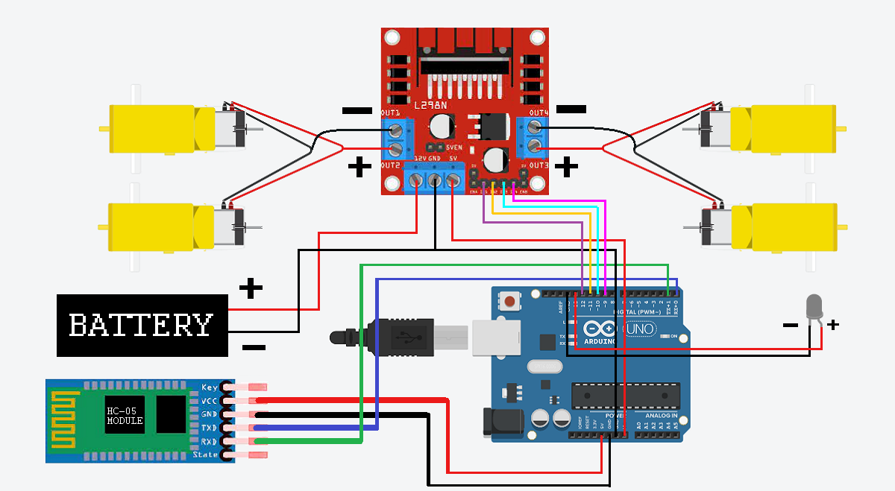

<h1>🚗 Arduino Bluetooth Controlled Car </h1>
  
This project demonstrates how to build and control a simple car using an Arduino board, a Bluetooth controller (HC-05), a motor driver, and the Dabble mobile app. Our team designed and assembled this car to be controlled wirelessly via a smartphone using Bluetooth communication.

  <h1>📦 Features </h1>  
  
  * Wireless car control using the Dabble mobile app
  * Real-time command response using Bluetooth (HC-05)
  * Motor driver integration for bidirectional motor control
  * Responsive navigation (forward, backward, left, right, stop)

<h1> 🧰 Hardware Components</h1>

* Arduino Uno
* HC-05 Bluetooth Module
* L298N Motor Driver Module
* 4 DC motors with wheels
* 3D printed Chassis
* Power supply (battery pack)
* Jumper wires

<h1>📱 Software & Tools </h1>

* Arduino IDE
* Dabble mobile app (Android/iOS)
* Solidworks

<h1>🔌 Hardware Schematic </h1>

<h1>👥 Team Members </h1> 
<h3> Team 2: Gà 🐔</h3>
<table>
  <thead>
    <tr>
      <th>Role</th>
      <th>Name</th>
      <th>Tasks</th>
    </tr>
  </thead>
  
  <tbody>
    <tr>
      <td>Leader</td>
      <td>Hoang Le</td>
      <td>Assigned tasks and supervising team members. Managed BOM and assemble hardware components. Recorded video of the car. </td>
    </tr>
    <tr>
      <td>Member</td>
      <td>Khoa Vo</td>
      <td>Helped leader managing BOM and vendors. Wrote lists of components with their functions. </td>
    </tr>
    <tr>
      <td>Member</td>
      <td>Ngan Nguyen</td>
      <td>Design robot's chassis. Manage wiring and schematic. Wrote README. </td>
    </tr>
    <tr>
      <td>Member</td>
      <td>Vong Duong</td>
      <td>Coded and debugged the program.</td>
    </tr>
  </tbody>
</table>

